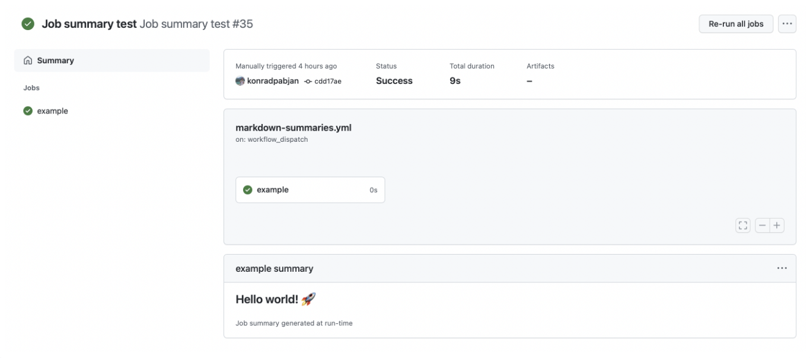

# Create a Job Summary

[Job summaries](https://github.blog/2022-05-09-supercharging-github-actions-with-job-summaries/)
are Markdown files generated by GitHub Actions and displayed on the summary page
of each job.



> [!NOTE]
>
> This behavior is slightly different from what happens on GitHub Actions
> runners. If the file referenced by `GITHUB_STEP_SUMMARY` does not exist, the
> workflow run will fail with an error like the following:
>
> `Unable to access summary file: '/path/to/summary'.`
>
> However, GitHub Actions normally creates this file for you, so functionally
> you should not see a difference :blush:

When testing with `local-action`, you can output the summary for your action to
a file. Just set the `GITHUB_STEP_SUMMARY` environment variable in your
[`.env` file](../.env.example). If the summary file does not exist, it will be
created.

```ini
GITHUB_STEP_SUMMARY="/path/to/summary.md"
```

> [!WARNING]
>
> If your action calls `core.summary.write()` and no value is set for this
> environment variable, the action will fail!
